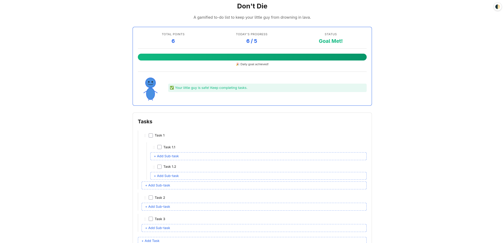
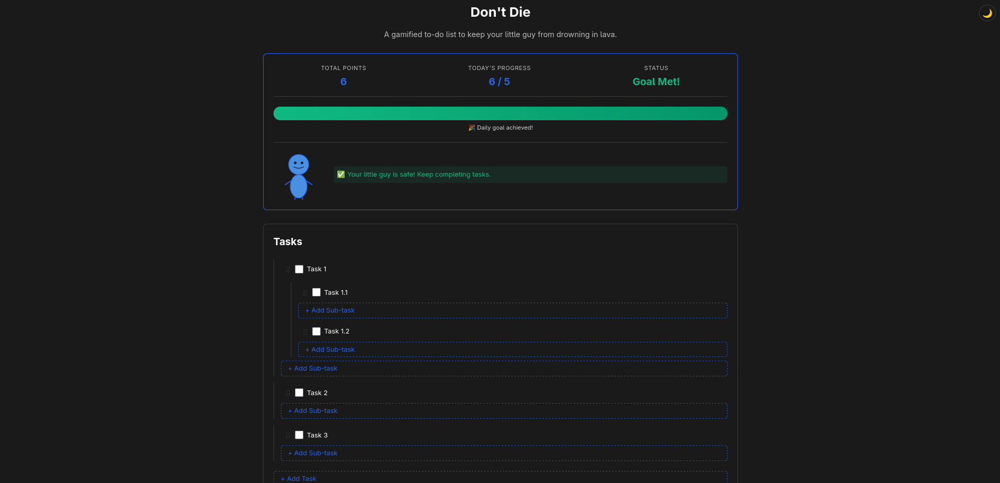
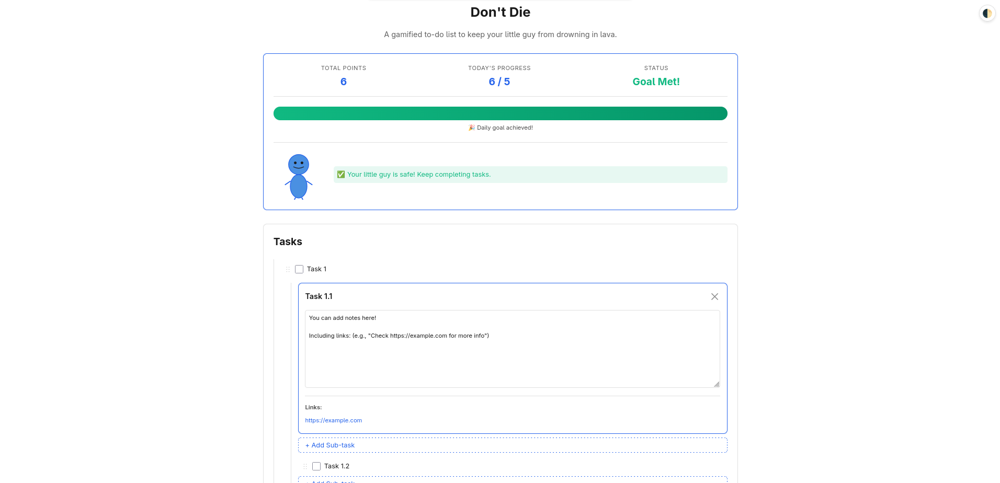
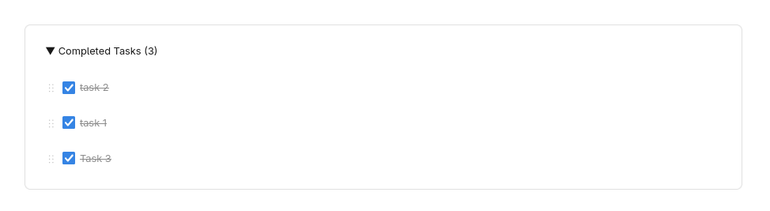
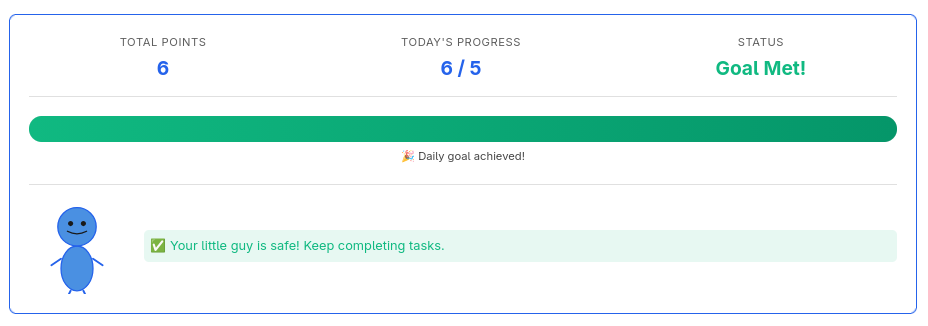
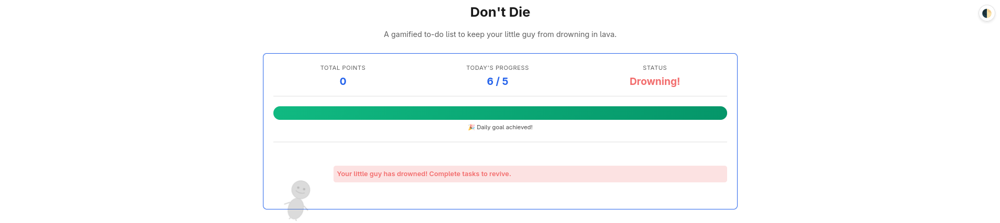

# Don't Die 🔥

A gamified to-do list app where you earn points by completing tasks — or your little guy drowns in lava.

**Local-first. No hosting. No backend. Just you, your tasks, and rising lava.**

---

## ✨ Features

- **Hierarchical Tasks**: Organize tasks with unlimited sub-tasks (up to 3 levels deep)
- **Drag-and-Drop Reordering**: Intuitive task organization with keyboard support
- **Expandable Notepads**: Click any task to add detailed notes with automatic URL extraction
- **Gamification Mechanics**: 
  - Earn 1 point per completed task
  - Daily goal: 5 points
  - Miss a day? Your lava guy gets closer to drowning
  - 10 consecutive zero-point days = Game Over
- **Dark Mode**: Auto, light, or dark themes with system preference detection
- **Backup & Restore**: Export/import your data as JSON
- **Fully Local**: All data stored in your browser's IndexedDB (no cloud, no tracking)
- **Accessible**: WCAG AA compliant with full keyboard navigation and screen reader support

---

## 🚀 Quick Start

### Prerequisites
- **Node.js 22+** (or use nvm: `nvm use`)
- npm or yarn

### Installation

```bash
# Clone the repository
git clone https://github.com/emibock/dont-die.git
cd dont-die

# Install dependencies
npm install

# Start development server
npm run dev
```

The app will open at `http://localhost:5173`

### Build for Production

```bash
npm run build
npm run preview  # Preview the production build
```

---


## Screenshots

### Main Interface



### Features



### Gamification - Lava Guy States
   

## Demo


## 📖 How to Use

### Adding Tasks

1. Click **"Add task"** at the bottom of the task list
2. Type your task name and press **Enter** or click **"Add"**
3. Click on a task to expand its notepad and add detailed notes
4. Add sub-tasks by clicking **"Add sub-task"** under any task

### Earning Points

- Check off a task to earn **1 point** and move it to the archive
- Daily goal: **5 points**
- Complete your daily goal to keep your guy safe!

### The Lava System

Your "lava guy" status depends on consecutive zero-point days:

- **0-3 days**: ✅ Safe (guy stands upright)
- **4-6 days**: ⚠️ Warning (guy wobbles nervously)
- **7-9 days**: 🚨 Danger (guy panics with rapid shaking)
- **10+ days**: 💀 Drowning (guy submerged in lava, game over)

**Recovery**: Complete tasks to reset your countdown and save your guy!

### Drag-and-Drop

- **Mouse**: Click and drag the `⋮⋮` handle to reorder tasks
- **Keyboard**: 
  - Focus a task with **Tab**
  - Press **Space** to grab
  - Use **Arrow keys** to move
  - Press **Space** again to drop
  - Press **Escape** to cancel

### Backup & Restore

1. Click **"Export Backup"** to download your data as `dont-die-backup-YYYY-MM-DD.json`
2. Store the file safely (recommended: weekly backups)
3. Click **"Import Backup"** to restore from a JSON file
4. **Warning**: Importing replaces all current data (confirmation required)

### Archive

- Completed tasks are automatically moved to the **Archive** section
- Click **"Completed Tasks"** to expand and view your accomplishments
- Archived tasks still count toward your total points

---

## 🛠️ Tech Stack

- **[React 19](https://react.dev/)**: UI framework
- **[TypeScript 5.9+](https://www.typescriptlang.org/)**: Type safety
- **[Vite 7](https://vite.dev/)**: Build tool and dev server
- **[Zustand](https://zustand.docs.pmnd.rs/)**: Lightweight state management (~1KB)
- **[Dexie.js](https://dexie.org/)**: IndexedDB wrapper for persistence
- **[@dnd-kit](https://dndkit.com/)**: Modern drag-and-drop library
- **[Motion](https://motion.dev/)**: Declarative animations for lava guy states
- **[Vitest](https://vitest.dev/)**: Fast unit testing
- **[@testing-library/react](https://testing-library.com/react)**: Component testing
- **[vitest-axe](https://github.com/chaance/vitest-axe)**: Accessibility testing

---

## 🧪 Testing

```bash
# Run tests
npm test

# Run tests in watch mode
npm run test:watch

# Run tests with coverage
npm run test:coverage
```

**Current test coverage**: 164 tests across 14 test files, 80%+ coverage

---

## 🏗️ Project Structure

```
dont-die/
├── src/
│   ├── components/          # React components
│   │   ├── TaskList.tsx     # Root task container
│   │   ├── TaskItem.tsx     # Draggable task row
│   │   ├── TaskItemExpanded.tsx  # Notepad view
│   │   ├── SubTaskList.tsx  # Recursive sub-tasks
│   │   ├── GamificationBar.tsx   # Points + lava guy
│   │   ├── ArchiveView.tsx  # Completed tasks
│   │   ├── ExportImport.tsx # Backup controls
│   │   ├── DarkModeToggle.tsx    # Theme switcher
│   │   └── ErrorBoundary.tsx     # Error handling
│   ├── stores/
│   │   ├── useTaskStore.ts  # Task CRUD + hierarchy
│   │   └── useGameStore.ts  # Points + lava logic
│   ├── db/
│   │   └── schema.ts        # Dexie IndexedDB schema
│   ├── utils/
│   │   ├── points.ts        # Point calculation
│   │   ├── lavaLogic.ts     # Lava state machine
│   │   └── taskTree.ts      # Hierarchy helpers
│   └── types/
│       ├── task.ts          # Task interfaces
│       └── game.ts          # Gamification interfaces
├── public/
│   └── lava-guy.svg         # SVG character
├── vite.config.ts
├── tsconfig.json
├── package.json
├── LICENSE                   # MIT License
└── README.md                 # This file
```

---

## 🤝 Contributing

Contributions are welcome! Please read [CONTRIBUTING.md](./CONTRIBUTING.md) for:

- Development setup
- Code style guidelines
- Testing requirements
- Pull request process

---

## 📄 License

This project is licensed under the **MIT License** - see [LICENSE](./LICENSE) file for details.

---

## 💡 Why "Don't Die"?

Because nothing motivates productivity like watching a tiny guy slowly sink into lava. 🔥

Built with ❤️ by [Emily Bock](https://github.com/emibock)
